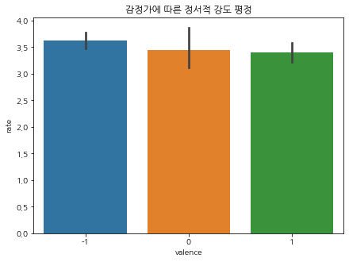
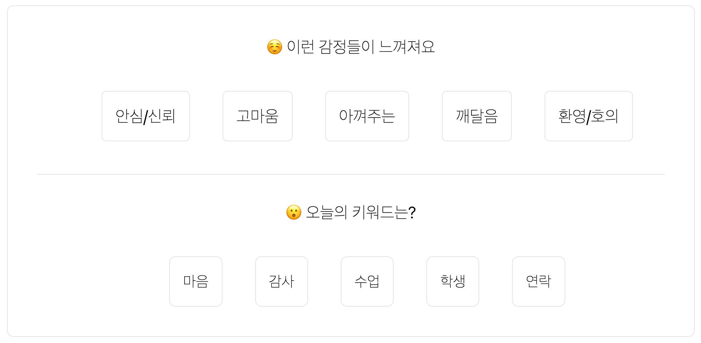

# GNOTHI-ProjectSocrates

.png)

## 1. 프로젝트 개요

### 1.1 주제

**GNOTHI - PROJECT SOCRATES**

기록하는 사람을 위한 분석 AI - 개인의 SNS를 통해 자신을 돌아볼 수 있는 대시보드 서비스 구현

### 1.2 주제 선정의 배경

<aside>
💡 **‘그노티 세아우톤(γνῶθι σεαυτόν)’ - 너 자신을 알라**

</aside>

소크라테스의 명언으로 알려진 이 말은 고대 그리스 델포이의 아폴론 신전 기둥에 새겨진 글귀에서 비롯하였습니다.

오늘날의 우리는 많은 양의 정보를 사회관계망서비스(SNS)를 통해 보고, 듣고, 또 소비하고 있습니다. 정보는 점점 많아지지만 역설적으로 그 안에서 본인을 알 기회는 점점 적어지고 있습니다.

우리의 아이디어는 바로 여기서 출발하게 되었습니다. 수많은 정보 속에 매몰되지 않고 온전히 자신을 돌아볼 수 있는 서비스를 구현해보고 싶었습니다. 우리는 그저 순수하게 사람을 궁금해 합니다. 우리의 서비스가 한 사람, 한사람을 빛내주기를 바랍니다. 

현재도 개인의 SNS 게시물을 분석해주는 서비스는 많이 존재합니다. 하지만 현재 SNS에서 제공하는 통계는 개인을 알기 위한 용도보다는 관계에 집중되어 있습니다. 대부분이 마케팅을 위한 목적의 서비스로서 기술이 사람 자체를 조명하기 보다는 상품을 부각시키는 특성을 보여줍니다.

**‘타인의 시선 속의 나’ 가 아닌 오롯이 나에게 집중할 수 있는 시간을 만들어보고 싶었습니다.** 

- 내가 아닌 타인의 시선에 집중한 SNS 분석 내용 예시
    - 인스타그램 분석툴
        
        
        
        
        
    - 네이버 블로그 분석툴
        
        
        
    - SNS 마케팅 분석툴
        
        
        
- 네이버 블로그와 MZ세대
    
    
    
    ****"기록이 성장으로"…네이버 블로그, '주간일기 챌린지'로 MZ세대 갓생러 응원****
    
    ["기록이 성장으로"&hellip;네이버 블로그, '주간일기 챌린지'로 MZ세대 갓생러 응원](https://www.inews24.com/view/1485356)
    
    <aside>
    📰 이번 챌린지는 자기계발과 성취감을 중요시해, 트렌드를 넘어 하나의 라이프스타일로 '갓생'을 사는 MZ세대 이용자를 위해서 마련됐다. '갓생'은 특정한 목표를 세우고 이를 실천하며 하루하루 알차게 살아가는 것을 의미한다. 꼭 거창한 목표가 아니더라도 ‘매일 30분 운동하기’, ‘매일 물 2L 마시기’, ‘매주 일기 쓰기’ 등 소소하지만 자신만의 루틴을 만들어 건강한 생활 습관을 유지하는 것이 핵심이다.
    갓생 살기에 빠진 MZ세대의 기록 공간으로 '네이버 블로그'가 활용되는 점을 이용한 것. 블로그는 최근 유행하는 숏폼 콘텐츠 플랫폼과 달리, 텍스트와 이미지, 동영상 등 다양한 포맷을 활용할 수 있고 콘텐츠 분량에 구애받지 않아 만능 기록 공간으로 호응받고 있다.
    특히 MZ세대는 자신이 세운 목표와 성취 과정을 SNS에 기록하고 공유하며 동기부여를 얻는 것이 특징이다. 블로그는 같은 목표와 관심사를 중심으로 관계 맺는 '이웃'과 소통할 수 있어 매력적이라는 평가다. 뿐만 아니라, 빠르게 변화하는 트렌드에 따라 사라지는 여러 SNS와 달리, 약 20년 간 안정적인 서비스를 제공하여 사용자들의 신뢰를 얻고 있는 점도 장점으로 꼽힌다.
    실제 네이버 블로그는 작년부터 이어져 온 갓생 열풍으로 역대급 성장 곡선을 그리고 있다. 작년 MZ세대 사용자 유입이 증가하며 전체 사용자 중 MZ세대 비중이 약 70%까지 늘었다. 1020세대의 비중도 44%나 됐다. 실제 지난 5월 진행된 ‘오늘일기 챌린지’ 당시 MZ세대가 전체 참여자의 80% 이상을 차지했다.
    김보연 네이버 블로그 리더는 "MZ세대 사용자들은 일주일 동안 다녀온 핫플레이스나 맛집, 친구와 가족과 함께 보낸 시간, 자기계발을 위한 운동이나 공부, 독서 등 일상적인 이야기를 블로그에 꾸준히 기록하는 것이 특징"이라며 "주간일기 챌린지가 블로거들에게 기록으로 한 층 더 성장하는 경험을 선사하는 기회가 되길 바란다"고 말했다.
    
    </aside>
    

### 1.3 프로젝트 목표

사용자가 올린 기록을 분석하여 글의 상황, 감정 등을 요약하고 시각화 한 대시보드를 서비스하고자 합니다. 

삶을 살아가는 개개인은 늘 기록하고 있지만, 스스로 되돌아보기란 쉽지 않습니다. 내가 좋아한 것, 자주 봤던 책, 자주 갔던 곳, 자주 했던 말, 그리고 나의 감정 상황들을 정리해주는 차별화 된 서비스를 제공하고자 합니다.

저희는 기록을 통해 나를 알아가고 있는 모든 사람들에게 이 서비스를 제공하고 싶습니다.  

### 1.4 프로젝트 흐름도

## 2. 데이터

### 2.1 데이터 수집

샘플데이터 - 동의를 받은 개인의 SNS 데이터

- 개인의 블로그 데이터를 제공받았습니다.

### 2.2 데이터 전처리

- 개인 블로그를 스크래핑하여 글 내용만 가져올 수 있게 **전처리** 진행하였습니다.

## 3. 모델

### 3.1 감정분류 모델

- 감정 분류(사전 학습모델 사용)
    
    KOTE(Korean Online That-gul Emotions)  데이터셋을 사전학습한 **KcElectra 모델**을 활용하여 게시글의 내용을 43가지 감정에 대한 확률로 분류
    
    - [KOTE dataset 논문](https://www.notion.so/416144720d7040b3858cae5ea9d51cdc)에 따른 43가지 감정에 대한 valence 구분 (긍정: 14개 / 부정: 25개 / 중립: 4개)
        
        
        
    
- 대표 정서
    
    게시글에 대한 모델 분석 결과 확률 상위 5개의 감정 단어를 대표 정서로 선정
    
- 단어의 정서적 강도 평정
    - 43개의 감정 단어에 대한 정서적 강도 설문(*N* = 9)
        
        
        
    
    
    
    - 긍정/부정/중립 정서에 따른 정서적 강도 평정에 유의한 차이가 나타나지 않았음
    (Linear mixed model with random subject intercept: *F(*1, 222) = 1.22, *p* = .344)
        
        Note. 평정자의 수가 차이를 보기에 부족함(*N* = 9)
        
        
        
    - 평정된 단어별 정서적 강도는 게시글의 감정 강도를 계산하는데 **가중치**로 활용함

- 감정 지표 산출
    - 감정 점수
    감정 점수는 해당하는 날짜의 게시글에 나타난 긍정과 부정 정서 중 어느 것의 비중이 더 큰 지 나타냅니다. 감정 점수가 0보다 큰 날은 긍정 정서가, 0보다 작은 날은 부정 정서가 강한 날이었음을 한눈에 확인할 수 있습니다.
        
        
        
        분석된 감정 점수 그래프의 예시
        
    
    - 감정 강도
    감정 강도는 해당하는 날짜의 게시글에 나타난 정서의 긍/부정성과 상관 없이 정서적 강도가 얼마나 강한지 나타냅니다. 상대적 감정 강도는 감정 강도를 기간 내 평균 감정 강도로 나누어, 각 게시물에 나타난 감정 강도가 평소에 비해 얼마나 강한지 나타냅니다. 기간 내 평균 정서 강도를 1로 할 때, 상대적 감정 강도가 1보다 큰 날은 평소보다 정서적으로 강한 경험을, 1보다 작은 날은 정서적으로 약한 경험을 한 날이라고 볼 수 있습니다. 만일 1보다 큰 날이 짧은 주기로 계속해서 지속되었다면, 해당기간 동안 정서적인 번아웃 상태를 경험했을 가능성을 추정해볼 수 있습니다.
        
        
        
        분석된 상대적 감정 강도 그래프의 예시
        
    - 감정 지표 산출 공식
        
        
        
- 감정 분류 예시 코드
    
    [GNOTHI-ProjectSocrates/Post_emotion_inference_summary.ipynb at main · lyrics4you/GNOTHI-ProjectSocrates](https://github.com/lyrics4you/GNOTHI-ProjectSocrates/blob/main/emotionModule/Post_emotion_inference_summary.ipynb)
    

### 3.2 키워드 추출 모델

- 키워드 분석
    
    **Konlpy Mecab**을 통한 형태소 분석과 **SBERT**를 이용한 키워드 추출
    
- 키워드 추출 모델 비교
    - 테스트 내용 예
        
        
        
        
        
    - 본문내용
    
    <aside>
    💡 비 오는 날의 산책은 제법 낭만적이다. 왜 그럴 때 있지 않나. 우비를 쓰고 빗 속에 몸을 내던지고 싶을 때. 조금 이상하게 보일 수도 있겠지만 수직으로 하강하는 액체와 횡으로 걷는 인간의 조합은 어찌 보면 그 풍경 하나만으로 예술적이기도 하다. 차가 막히고, 위험하고, 옷이 젖는 등 어떤 불편함을 다 갔다 붙여도 이상할 것 같지 않은 호우경보의 여름날이지만 불편함이 아닌 즐거움으로 해석하기도 그만큼 쉽다. 타닥 타닥 쏴아 쏴아 퍼붓는 빗소리, 우비에 떨어지는 약간의 둔탁한 소리, 발가락 끝에 느껴지는 차가움, 특유의 비릿한 비 냄새까지. 온 감각이 비로 인해 열리는 순간을 짧고 굵게 기억하고 싶었던 걸지도 모르겠다.
    
    </aside>
    
    - Mecab 형태소 분석 - word cloud
    
    
    
    - 모델 선정
    
    | TF-IDF | multi-qa-MiniLM-L6-cos-v1s | xlm-r-100langs-bert-base | distiluse-base-multilingual-cased-v2 | KR-SBERT |
    | --- | --- | --- | --- | --- |
    | 우비 | 우비 | 순간 | 지도 | 여름날 |
    | 불편 | 발가락 | 조합 | 기억 | 빗소리 |
    | 호우 | 산책 | 경보 | 냄새 | 우비 |
    | 하강 | 인간 | 하강 | 빗소리 | 호우 |
    | 조합 | 낭만 | 해석 | 여름날 | 산책 |
    | 빗소리 | 기억 | 감각 | 호우 | 즐거움 |
    | 낭만 | 수직 | 불편 | 우비 | 특유 |
    | 경보 | 여름날 | 호우 | 낭만 | 발가락 |
    | 특유 | 하강 | 특유 | 액체 | 낭만 |
    | 위험 | 경보 | 기억 | 산책 | 감각 |

### 3.2.1 키워드 추출

- 감정분석 모델을 통해 글에서 감정을 확인합니다.
- 키워드 추출 모델을 통해 글에서 키워드를 추출합니다.

### 3.2.2 낱말 구름 ☁️

- 기간별, 날짜별 감정과 관련된 단어나 자주 사용한 단어를 확인할 수 있습니다.
- 내가 어떤 것에 관심이 있었고, 어떤 일들이 있었는지 회고하는데 도움을 줄 수 있습니다.

### 3.3 만족도 조사

- 4명의 블로그 작가 별 각 5개의 포스트 글에 대하여 모델 분석한 결과에 대해 팀원 자체 조사로 1~5점의 만족도 평정을 실시함(*N* = 4)
- 설문 예시
    
    
    
    
    
- 결과: 통계적으로 작가별/질문별 평점이 응답 가능한 평점 중앙값인 3과 비교할 때, 유의하게 높음
    
    
    
    
    

## 4. 배포

- Next.js를 기반으로 vercel에서 배포 예정.
    
    
    
    
    

## 5. 활용방안

- 블로그, 인스타그램, 일기 등의 기록물을 직접 업로드하여 저장하고 분석할 수 있게 한다.
- 개인의 글쓰기 패턴과 자주 쓰는 단어 등을 분석해주는 방향으로도 고려해 볼 수 있다.
- 사진 정보를 수집해 감정에 따른 사진을 사용자에게 보여줄 수 있다.
- 글쓰기 키워드를 통해 자동으로 태그를 생성할 수 있다.

## 6. 출처

### 모델 출처

[GitHub - searle-j/KOTE: Korean Online That-gul Emotions Dataset](https://github.com/searle-j/kote)

[GitHub - snunlp/KR-SBERT: KoRean based SBERT pre-trained models (KR-SBERT) for PyTorch](https://github.com/snunlp/KR-SBERT)

[GitHub - MaartenGr/KeyBERT: Minimal keyword extraction with BERT](https://github.com/MaartenGr/KeyBERT)

### 참고자료

[User Guide for KOTE: Korean Online Comments Emotions Dataset](https://arxiv.org/abs/2205.05300)  

## 우리 팀을 소개합니다.
 
|  이주승  |  양조은  |  윤재은  |  이지홍  |  한성민  |
|--------|--------|--------|--------|--------|
| </img> | </img> | </img> | </img> | </img> |
|  |  |  |  |  |